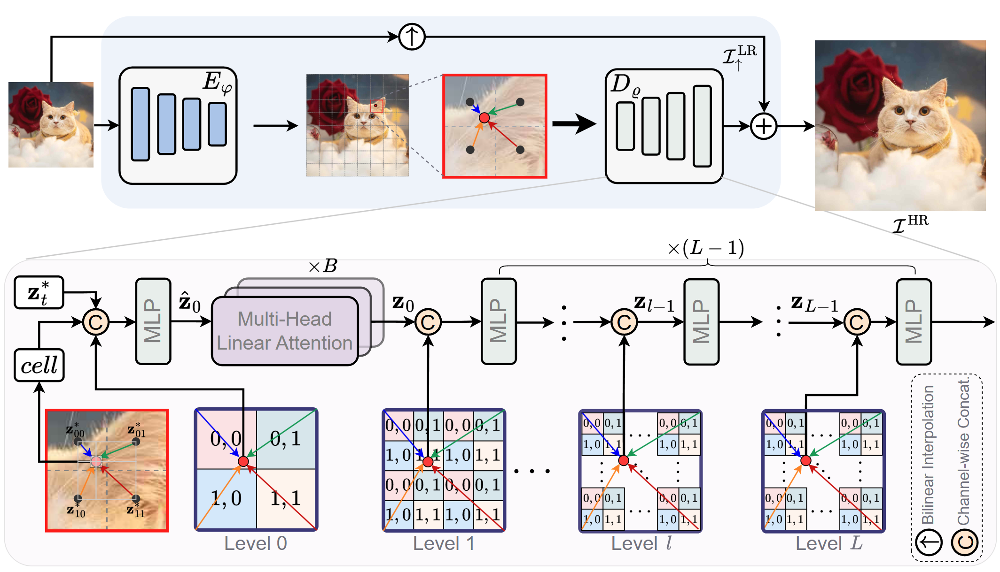
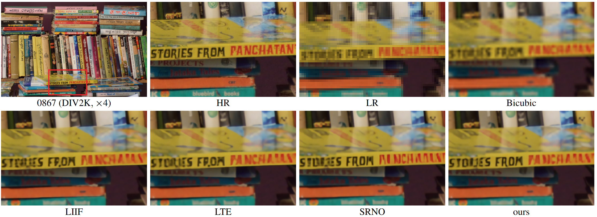
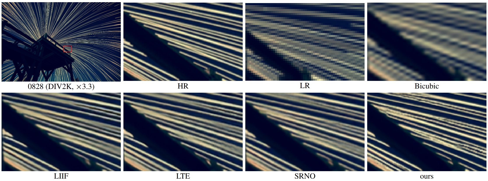
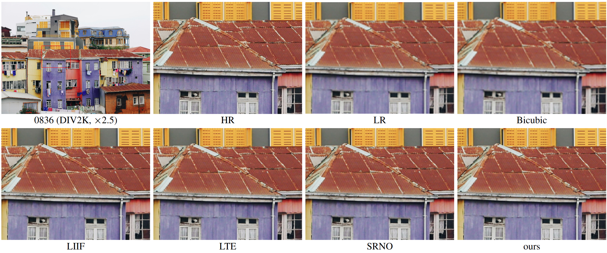
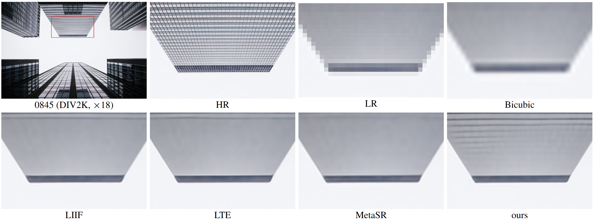
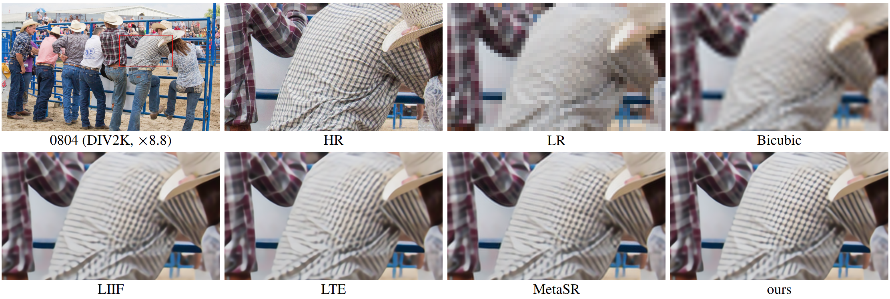
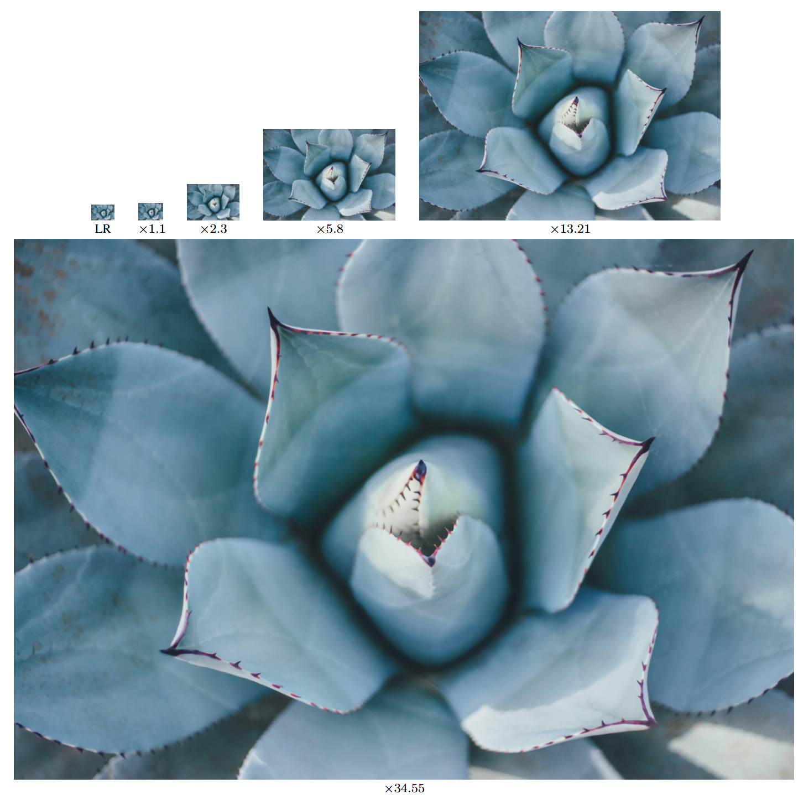

# HIIF (CVPR2025) [[Paper](https://arxiv.org/pdf/2412.03748)]
<p align="center">
    
</p>

```
conda create -n hiif python=3.10.14
conda init
conda activate hiif

pip install torch==2.1.1 torchvision==0.16.1 torchaudio==2.1.1 --index-url https://download.pytorch.org/whl/cu118
pip install tqdm
pip install einops
pip install typing_extensions
pip install imageio
pip install timm
pip install pytorch_wavelets
pip install opencv-python
pip install matplotlib
pip install tensorboardX
```

## <a name="cite"></a> Citation

Please cite us if our work is useful for your research.

```
@article{jiang2024hiif,
  title={HIIF: Hierarchical Encoding based Implicit Image Function for Continuous Super-resolution},
  author={Jiang, Yuxuan and Kwan, Ho Man and Peng, Tianhao and Gao, Ge and Zhang, Fan and Zhu, Xiaoqing and Sole, Joel and Bull, David},
  journal={arXiv preprint arXiv:2412.03748},
  year={2024}
}
```

## 📑 Train & Test
EDSR-baseline-HIIF
```
python train.py --config configs/train-div2k/train_edsr-baseline-hiif.yam
bash ./scripts/test-div2k-fast.sh ./save/edsr_baseline_hiif.pth 0
```


---

## 📊 Model Summary
DIV2K pre-trained model
Model|Download
:-:|:-:
edsr_hiif|[Google Drive](https://drive.google.com/file/d/1XoEXicdiGMMnHKH0Im8rJYXijjywK1K9/view?usp=sharing)
rdf_hiif|[Google Drive](https://drive.google.com/file/d/1-S5bE4f-emtWw1VMCMuWHqZu8IjKaIwS/view?usp=sharing)
swinir_hiif|[Google Drive](https://drive.google.com/file/d/13wrPTcOqLnNDm9c14h1uPTQEWjOzQ9cd/view?usp=sharing)


## 🔍 Qualitative Results
<p align="center">
  
</p>

<p align="center">
  
</p>

<p align="center">
  
</p>

<p align="center">
  
</p>

<p align="center">
  
</p>


## 🔍 Arbitrary-Scale demo
<p align="center">
  
</p>


## Acknowledgements

This code is built on [LIIF](https://github.com/yinboc/liif) and [LTE](https://github.com/jaewon-lee-b/lte). We thank the authors for sharing their codes.

---
